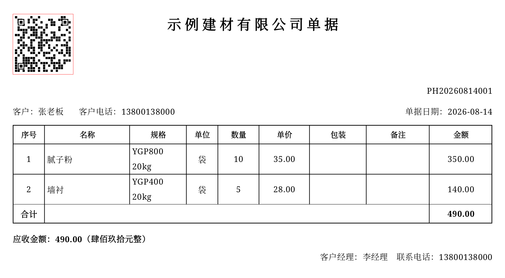
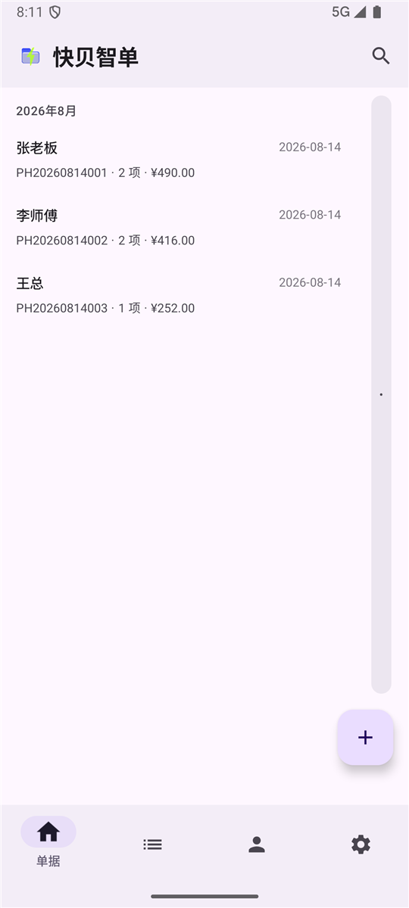
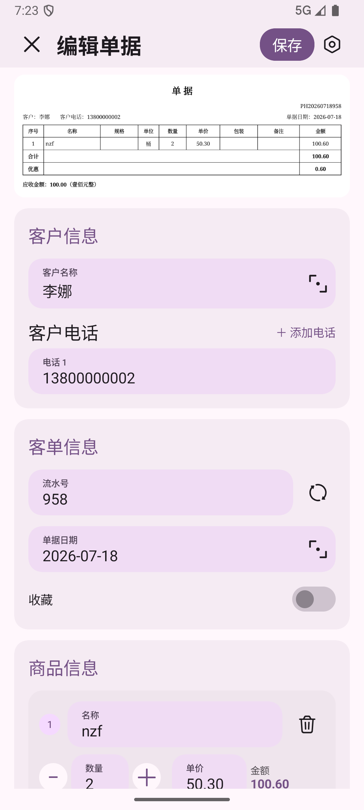
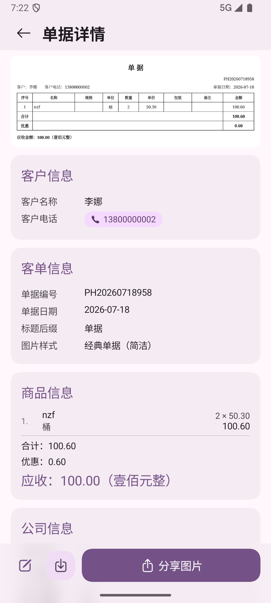
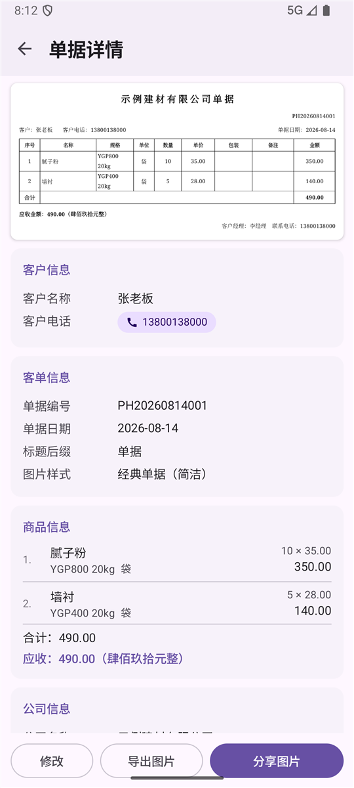

# 快贝智单（QuickBillMate）

<p align="center"></p>

快贝智单 QuickBillMate，面向小微商户和建材/日杂销售场景的 **便捷销售单据生成器** 安卓软件，免费，开源，无需联网，体积很小（3.3MB）。
在手机上填写客户与单据信息、勾选商品，生成销售单据的高清图片，即可保存或分享给微信好友。

## 安装

点击页面右侧的Releases，下载Assets里面的第一个文件，即APK安装包，安装到手机上（如提示“未知来源”，选择允许本次安装即可）。

## 核心功能

单据图片导出示例（二维码和电话号码仅为示意）：



- **单据**：新建 / 编辑 / 实时预览。
- **导出图片**：可以预览与导出单据图片，一键保存到相册或分享。
- **微信二维码**：在设置中上传收款码图片，方形裁剪后显示在所有单据左上角。
- **单据样式**：内置 4 套预设（经典单据、经典单据（简洁）、简洁现代、商务蓝），支持自定义。
- **商品库**：增删改查、收藏、按字母索引，支持 JSON 批量导入 / 导出（文件或剪贴板）。
- **客户库**：增删改查、收藏、多电话支持、通讯录导入、拼音排序、按字母索引。
- **更多**：客户电话拨打，深色 / 浅色主题……

## APP界面预览

|                单据列表                |           单据编辑（实时预览）           |                 单据详情                 |
| :------------------------------------: | :--------------------------------------: | :--------------------------------------: |
|  |  |  |

|                  商品库                  |                  设置                  |
| :--------------------------------------: | :------------------------------------: |
|  |  |

## 路线图

快贝智单的定位，不只是“一张单据生成器”，而是一步步成长为**懂数据的智能销售助手**：让数据产生价值，操作变得自然，最后成为可协作、可被 AI 调用的数据基础设施。以下是规划中的功能：

**1. 报表统计 ⭐⭐⭐**
折线图看销售趋势、饼图看品类结构、排行榜识别高价值客户，一键生成经营周报/月报，让每一次决策都有数据支撑。

**2. 语音操作 ⭐⭐**
一个语音按钮，基于大模型支持连续对话——“给张老板开一张 10 袋腻子粉的单子，下周三送货”，一句话完成重复操作。

**3. 团队功能 ⭐**
从单人记账走向团队协同：数据分权共享，上下级之间分配单据与任务，老板看到全局、店员只看到自己的范围；后端服务预留标准接口（Skill），让 AI 工具也能安全地读写业务数据，未来可接入企业流程。

**4. 拍照存档 ⭐**
单据不再只是文字：支持拍照记录对应的货物与现场，自动叠加时间、地点水印，形成“看得见、可追溯”的经营凭证。

**5. 扫描单据 ⭐**
老纸质单据不用重录：拍照扫描 → 智能识别 → 结构化入账，历史账目一键电子化，告别翻箱倒柜。

还有一些体验上的优化：

- **数据自主可控**：支持 Excel（CSV）导入导出，数据随时可以迁移不被软件绑架。
- **商品图片**：支持为每个商品添加图片，选货更快、单据更直观。

## 技术栈

- Kotlin + Jetpack Compose + Material 3
- Room（SQLite）数据存储
- minSdk 29 / targetSdk 37

## 监控与合规

- 应用不申请联网权限。
- 崩溃监控采用**本地日志**方案：`filesDir/crash_logs/` 记录崩溃堆栈（时间、应用版本、设备信息、异常堆栈），不包含任何业务数据。
- 性能监控（启动耗时、卡顿率、APM）暂未接入，后续按需评估。

## 数据库与升级

- 数据库启用 Room 迁移机制。
- 数据库使用 TRUNCATE journal 模式，系统备份/恢复时主库文件保持一致。

## 构建与运行

使用 Android Studio 打开仓库后直接运行，或在命令行执行：

```bash
./gradlew assembleDebug   # 构建 debug APK
./gradlew installDebug    # 构建并安装到已连接的设备/模拟器
```

安装包名：`com.example.quickbillmate`

## 开发文档

- [设计文档](Design.md)
- [商品 JSON 导入模板](docs/products_template.json)

## 许可证

[Apache License 2.0](LICENSE)
